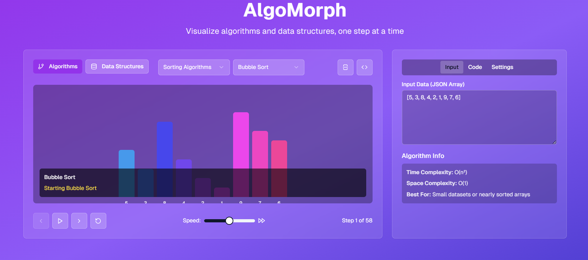

# 🧩 AlgoMorph  
**Shape Your Understanding of Algorithms — Visually.**

**AlgoMorph** is an interactive, web-based tool that lets you **visualize common algorithms and data structures** step by step that would help students, educators, and developers grasp the logic behind every transformation.

---
## 🖼️ Preview


*This is how AlgoMorph looks in action.*


---

## 🎯 What is AlgoMorph?

AlgoMorph brings algorithms and data structures to life through **animated, real-time visualizations** and **interactive controls**. You can step through code logic, visualize pointer movements, manipulate data live, and gain deep insights into how things work under the hood.

> _"From code to concept, one morph at a time."_ 🧠

---

- ## ⚙️ Features

- 🔍 **Step-by-Step Algorithm Tracing**
- 🧮 **Data Structure Animations**: Arrays, Trees, Graphs, Stacks, Heaps, and more
- ⚔️ **Comparison Mode**: Run two algorithms side-by-side and compare their behavior in real time
- 🎨 **Custom Input Handling**: Modify data and watch it morph in real-time
- 📊 **Code + Visual Sync**: Highlighted pseudocode alongside animations
- ⏯️ **Playback Controls**: Pause, rewind, fast-forward, and speed sliders
- 🧠 **Explainer Mode**: Tooltips and on-screen definitions
- 🧪 **Quiz Mode** *(Coming Soon)*: Predict next steps, test your intuition


---

## 🧱 Visualized Algorithms

### 🔢 **Sorting**
- Bubble Sort, Selection Sort, Insertion Sort  
- Merge Sort, Quick Sort, Heap Sort  
- Radix & Counting Sort  

### 🔍 **Searching**
- Linear, Binary, Interpolation, Exponential Search  

### 🔁 **Recursion & DP**
- Fibonacci, Factorial, LCS, Knapsack  
- Memoization vs. Tabulation

### 🌳 **Trees**
- Traversals (In/Pre/Post/Level Order)  
- AVL Rotations, BST Insertion/Deletion  
- Segment & Fenwick Trees  

### 🔗 **Graphs**
- BFS / DFS
- Dijkstra’s, Bellman-Ford
- Kruskal’s, Prim’s, Topological Sort

---

## 🧩 Visualized Data Structures

- Arrays, Stacks, Queues, Linked Lists
- Heaps, Hash Tables, Deques, Priority Queues
- Binary Search Trees, AVL Trees, Tries
- Graphs (Adjacency List & Matrix)
- Disjoint Set Union (Union-Find)
- Segment Tree, Binary Indexed Tree

---

## 🛠 Tech Stack

| Layer      | Tech                          |
|------------|-------------------------------|
| Frontend   | React.js, D3.js, Tailwind CSS |
| Animation  | Framer Motion / Anime.js      |
| Logic Core | JavaScript + Custom DSL       |


---

## 🚀 Getting Started

### 🌐 Live Demo
Check the projct out at https://algo-morph.vercel.app/

### Run Locally

```bash
git clone https://github.com/ju-baer/AlgoMorph
cd AlgoMorph
npm install
npm run dev

